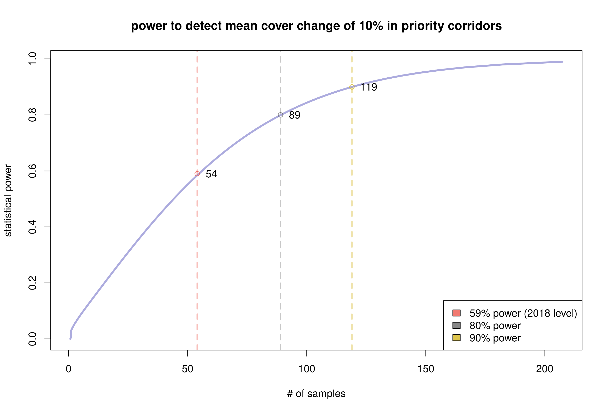
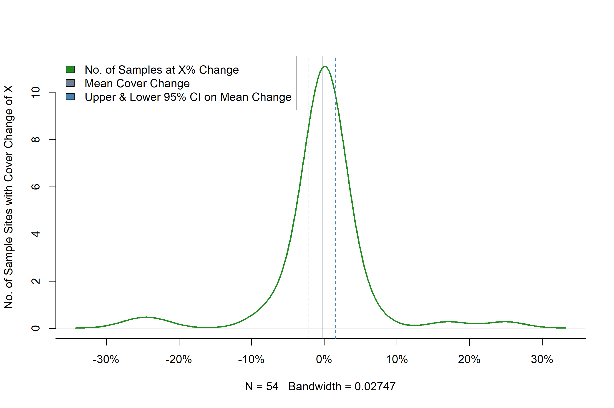
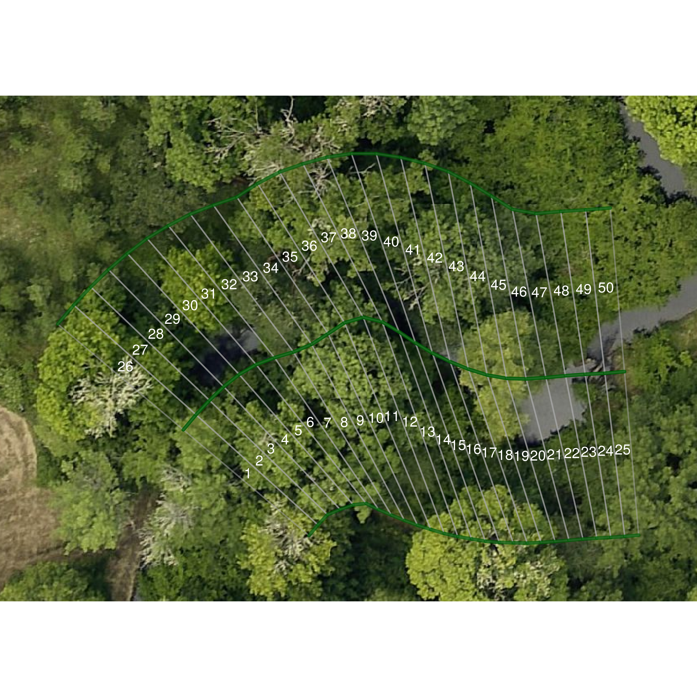
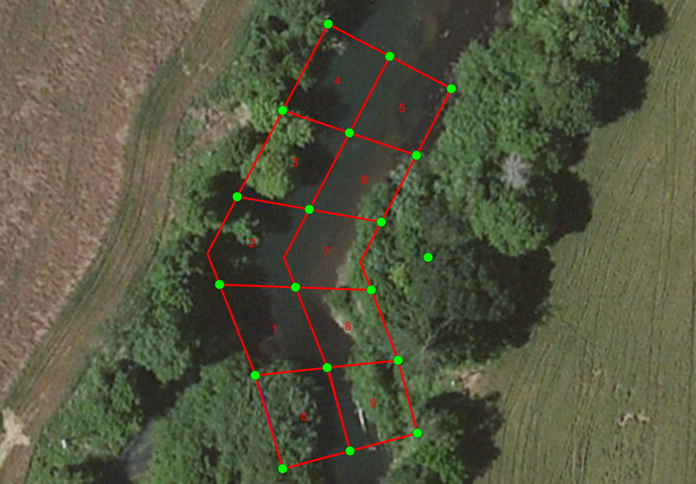
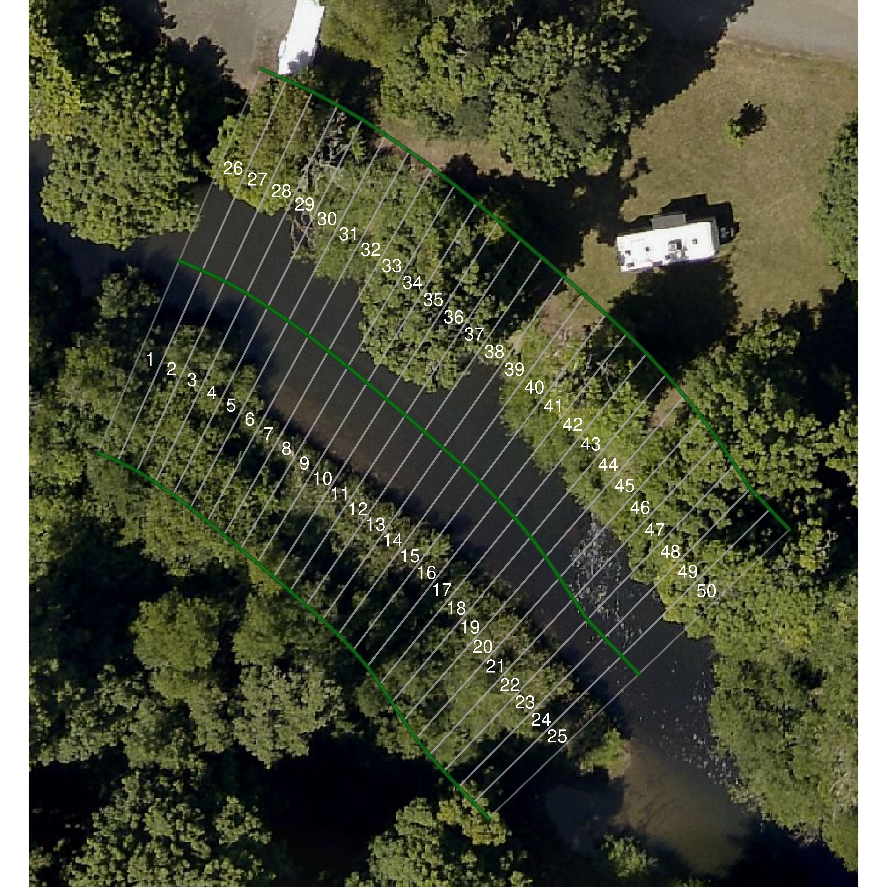
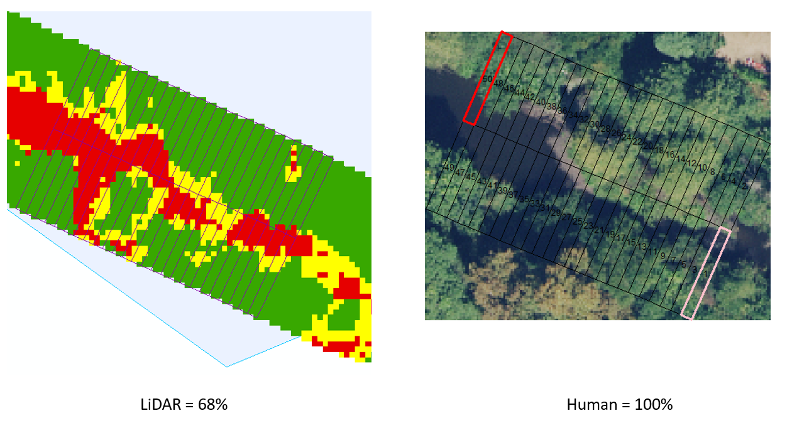

  
  ```{r setup, include = FALSE}
knitr::opts_chunk$set(
  collapse = TRUE,
  comment = "#>"
)
```
## Introduction

The Benton County Non-Regulatory Riparian Corridor Program is a voluntary effort from the County to meet stream temperature total maximum daily load (TMDL) requirements within the Willamette River Basin through a non-regulatory compliance process. Through this program the County develops and implements education, outreach, collaboration, monitoring, and adaptive management to support private rural property owners in protection and enhancement of native riparian vegetation. 

In conjunction with DEQ Water Quality Division staff, over a period of 2011 to 2013 the County developed a riparian vegetation sampling methodology to detect and respond to riparian cover loss.  The County monitors land along “priority riparian corridors”, which refers to perennial or fish-bearing streams in the Rural Residential zone that the County directly oversees and monitors. This document records the methodology staff use to monitor the extent of canopy cover in priority riparian corridors, and determine whether canopy cover has increased or decreased over the monitoring period.

## Main Research Questions

Monitoring reports indicate whether canopy cover extent in priority riparian corridors has increased or decreased over the monitoring period.  If the County identifies reductions to cover within priority riparian corridors during annual reports or the 5-Year Trends and Status Report, then DEQ may determine that it is necessary for the County to adopt a regulatory riparian protection program, based upon the level of reduction. The draft regulatory Stream and Riparian Corridor Overlay Zone ordinance proposes to allow “up to 10% or 2,000 square feet, whichever is less,” of vegetation removal per property within the priority corridor.  Staff determined that standards for cover loss in the voluntary program should be as stringent as the regulatory alternative, and that a decrease of 10% or more in cover within priority corridors would place the County out of compliance.

Determining whether cover loss has occurred involves answering four key questions:

 * What was the cover extent in year 1?
 * What was the cover extent in year 2?
 * Did the amount of cover change from year 1 to year 2?
 * How confident are we the change in cover did (or did not) occur?

Therefore, for the purposes of statistical analysis, staff selected a minimum sample size sufficient to ensure that if mean cover change was zero, the range of uncertainty around the estimate of the mean would be narrow enough to exclude the possibility of 10% or more cover loss with 95% confidence.  Staff also use 10% loss on individual properties within the priority corridor as a threshold to trigger staff response to property owners. 

## Scope of Analysis

### Where Cover Monitoring Occurs

The County has riparian oversight authority over land located within the Rural Residential zone that is not publicly owned, primarily in use for farm and forest activities, or within the urban growth boundary and city limits of the following incorporated cities: Corvallis, Albany, Philomath, Adair Village, and Monroe.  The program defines “priority riparian corridors” as 50-foot buffers (75-foot for main-stem Willamette River1) along either side of:

 1. Perennial streams (as determined by Benton County from USGS and BLM data), or
 2. ‘Fish Bearing’ streams with ‘verified’ and ‘assumed’ ‘fish presence’ map attributes (as determined by Oregon Department of Forestry).
    
When the County issues new building permits or land use application approvals for structures or uses on property that includes priority riparian corridor, staff provide information to the property owner on riparian habitat best-management practices.  Program staff document and track sites in the priority corridor where riparian vegetation removal impacts have occurred to determine if the removal relates to permitted development or is due to natural disturbance, hazard tree removal, or other non-native vegetation removal.  In cases of documented vegetation removal, program staff inform the property owners that vegetation removal risks the continued non-regulatory nature of the program, and provide information on methods to restore or mitigate impacts from vegetation removal.

### Determining Sample Size

The number of samples we collect determines the statistical power of our analysis.  If we collect too few samples, our conclusion will lack certainty and we may learn nothing new at all.  However, every additional sample increases the marginal cost of monitoring and the burden of the program on the taxpayer.  Increasing the level of statistical certainty around a conclusion often involves diminishing returns of investment, where taking many additional samples ends up providing little new information.

Statistical power analysis is the practice of estimating the minimum number of samples required to detect an effect of a given size within a population.  If we assume there is a difference of 10% between two populations, then the statistical power is akin to the chances that we would detect this difference by taking a sample of the given size from each group.

Using the monitoring data from 2016 & 2018, we can estimate the variance in mean cover extent over the priority corridors, and use this information to get a better estimate of the statistical power of the sample group.  The average standard deviation $\sigma$ in mean cover extent across permits and random sites was 0.237.  If we want to detect a difference in means $\Delta m$ of 0.1 (a 10% loss in cover), then the effect size `d` is:

$$ d = \frac{\Delta m}{\sigma} = \frac{0.1}{0.237} \approx 0.422 $$

This equations tells us how big an effect 10% cover loss is relative to overall variation in cover in the sample group.  A larger number indicates the effect will be easier to spot with fewer samples, while a smaller number indicates the effect is more subtle and may require a large number of samples to detect.

Figure 1 shows the statistical power curve for detecting a 10% change in cover within priority corridors, based upon 2016 & 2018 monitoring data, using the `power.t.test` function in R version 3.6.3.  The 2018 monitoring level shows a statistical power of 59%.  A common rule of thumb is to use 80% as the threshold for the best return on investment in statistical certainty from a marginal increase in sampling number.  Note that increasing the statistical power from 59% to 80% requires an additional 35 samples, an increase of 0.6% in power per extra sample, whereas increasing power from 80% to 90% requires an additional 39 samples, an increase of 0.2% in power per extra sample.

<center>

<br>
**Figure 1.** Statistical power curve for priority riparian corridors, based on 2018 data.
</center>

The ideal number of samples to collect is the minimum necessary to distinguish a change of 10% from a base case of no change with a certainty of 95% confidence.  Figure 2 from the 2018 5-year trends report shows an example of zero net cover change in random sampling sites from 2009-2016.  Note that the lower 95% confidence interval excludes 10% cover loss.  In this case, 54 samples was adequate to distinguish zero net change from a cover loss of 10% with 95% confidence.

<center>

<br>
**Figure 2.** Mean cover change from 2009-2016, from the 2018 5-year trend report.
</center>


If the mean change was zero, but the lower confidence bar included 10% loss, then we would not be able to confidently distinguish between an actionable level of cover loss and no change at all.  We would not be able to say more about cover change than someone who has not conducted a survey at all.  Consider also the case where mean cover change is near-to but above the threshold; the closer to the mean gets to the threshold, the more likely the lower confidence interval will overlap it.

In this situation, to clarify whether a confidence interval excludes or includes the regulatory threshold, one of the only options available to the researcher is to increase sample size to raise statistical power.  Use the curve in Figure 1 to estimate the potential increase in statistical power in response to an increase in sample size.  Bear in mind statistical power is an estimate, not a guarantee of victory.


## Assessing Cover Extent

Determining canopy cover extent is the most basic unit of analysis in riparian monitoring.  Determining whether canopy loss occurs involves taking a difference in canopy cover extents between two years, so a discussion of how to assess cover extent in a single year must necessarily precede an explanation of how to assess loss over time.  Determining loss between two years also requires assessing cover extent in each year prior to taking the difference.

Assess cover extent using the following steps:

 * Draw random samples along the stream path of the study area.
 * Construct a survey box around each sample point encompassing the riparian corridor.
 * Score the extent of cover within each sampling box.
 * Plot the results and produce summary statistics.


### Random Sampling of the Priority Riparian Corridor

Priority riparian corridors are areas within 50 feet of a perennial or fish-bearing stream in the Rural Residential zone.  Staff used the National Hydrology Dataset (NHD) to determine perennial and fish-bearing streams within the Rural Residential zone.  However, staff did not elect to use the NHD stream lines to conduct the actual monitoring.

In the riparian zone, cover changes can encompass areas as minute as a few square meters.  Stream lines from NHD can differ substantially from actual stream paths, and this error can significantly impact the accuracy of cover assessment.  The accuracy of the stream line is a primary influence on the quality of the monitoring data.  The highest quality of stream line data available to the county is a hydro-enforced drainage layer produced by Watershed Sciences, Inc. (WSI) in 2014.  The main advantage of the WSI hydro-enforced layer over the NHD layer is improved stream path accuracy.

The hydro-enforced drainage layer does not differentiate between perennial, fish-bearing streams, drainage ditches or culverts.  To sample within the priority corridor, staff draw random samples from along the stream path of perennial or fish-bearing streams in the Rural Residential zone using the NHD stream lines, then locate the nearest point on the WSI drainage layer to the selected point on the NHD layer.  This process is automated through the `sample_streams()` function in the `riparian` package.


### Sampling Box Protocol

At each sampling point, we want to superimpose a box over the imagery of the landscape.  This box will tell us what area is inside the corridor, but we will also subdivide it into smaller boxes or "slices".  These slices help us quantify a continuous phenomena like canopy cover into hard numbers that we can crunch on a spreadsheet.  For each sampling point, we are interested in the corridor along a portion of the stream 75 feet in either direction.  The surveying box extends a total of 150 feet along the stream path, and 50 feet perpendicular in either direction from the stream, encompassing the riparian corridor, approximately 15,000 square feet in area.

If we stopped every six feet along the 150-ft stream path and cut off a portion of our sampling box, like slicing a loaf of bread, we would end up with 25 segments along each bank of the stream, for 50 total.  We will assume that each slice is the same size (approximately 300 square feet), although we know this is not strictly true for streams that turn and meander.  Canopy cover can only be as full as 100%, so if each slice had full canopy it would account for 2% of total cover.  The goal here is to use the score values of the smaller slices inside the survey box to derive the total percent cover for the sample.

<center>

<br>
**Figure 3.** Example survey box showing ID numbers assigned to each "slice", or portion of the surveying box.
</center>

Figure 3 shows an example of a survey box superimposed over 2020 orthography.  The numbers on each slice correspond to a column in a spreadsheet where staff track cover score observations.  Note that the area encompassed by each slice changes in response to meander in the stream course.  We can generally ignore this difference in area because:

 * Changes in direction are random (a stream is equally likely to bend one way as another).
 * Slice area changes are equally distributed (slices on one side get squeezed and the other side expands).
 * The size of change is relatively small compared to instances of documented canopy loss (changes are unlikely to influence the detection of tree removal).
 * Changes in stream direction are independent of the presence or absence of canopy cover.

Technically, the presence of trees can and does impact the capacity of the stream to meander in response to stormflow, but this does not change the fact that a stream course may change direction unpredictably even in hardened urban environments.  Generally speaking, changes in slice size are equally likely to make the cover score go up or down.  The more samples we take, the more likely the sum of these differences will cancel each other out, and so these differences can safely be ignored.

#### Initiation/Endpoint Selection Bias

Each stream line in the dataset has a beginning and endpoint that may intersect with another stream line.  In the process of clipping the streams to include only those portions within priority riparian corridors, we create additional beginning and endpoints without adjacent stream junctions.  When we randomly select points along the stream to sample, if the line path does not continue for 75 feet in either direction, either along the stream segment or continuing along an intersecting stream, then we redraw a new sampling point.

One can justifiably argue that portions of the corridor near an endpoint or initiation point are less likely to be selected and scored using this method, introducing a selection bias.  This is because one can only observe an endpoint by selecting the position exactly 75 feet from the end of the segment, whereas one can observe most normal points by selecting any position within 75 feet of the point.

However, this issue is easier to identify than to correct.  If we adjust sampling points that occur near an endpoint to include the full 150-foot segment leading up to the endpoint, then we are now more likely to observe an endpoint than a normal portion of the stream, and no better off.  The danger in not sampling beginning and endpoints fairly is that our sample will not be representative of the priority corridor as a whole.  Currently, we ignore this potential source of sampling bias on the presumption that the impact on how well the sample represents the priority corridor is small.

#### Correction for Aspect Changes

We score riparian cover extent by visually examining aerial imagery collected from a survey plane.  A change in angle position of the survey plane relative to the riparian corridor can cause the taller portions of trees to appear inside a sampling box in one year and outside another.  Fitting aerial imagery to a coordinate projection system can produce warping distortion.  Even a minor GPS offset of less than a meter in the imagery can cause a cover extent score to change if the slice was on the cusp of either score and the difference shifts the balance in favor of a score change.  

Scoring records changes in cover extent of 1% of larger.  This resolution is of sufficiently high granularity to detect removal of individual trees from the priority riparian corridor.  The granularity is also of high enough resolution that minor discrepancies in capture angle and GPS positioning can affect the cover extent score, causing a false appearance of change where none has occurred.

Score changes due to aspect change were relatively rare in the 2018 sample set and the magnitude of the effect on the mean was generally less than 5%.  Aspect change errors in the sample were not biased upward or downward, and the net impact of aspect change on the estimate of the mean likely tends towards zero.  Therefore, aspect changes can safely be ignored except in those cases where it appears as cover loss.

If the change in score due to aspect change results in a false positive in the search process for tree removal, then staff will ascertain whether the scores are entered correctly and are not the result of a data entry error. Staff will then note the occurrence of aspect change error and remove the false positive from the list of potential tree removals.  

#### Centerline vs. Top-of-Bank

The best information we have on the physical location of streams in Benton County is the WSI hydro-enforced drainage layer, which represents the centerlines of streams as a series of lines in GIS.  Consequently, survey boxes intended to encompass the riparian corridor extent 50 feet from the centerline of the stream.  Technically, this is inaccurate because the riparian corridor extends 50 feet from the top-of-bank of the stream and not the centerline.

In common parlance, the top-of-bank is the bank edge.  When a stream overtops the bank edge, it is flooding.  For smaller streams, the bank edge is relatively close to the centerline because the stream is narrow, and the error associated with this method is small.  However, perennial and fish-bearing streams are among the wider streams in the watershed, and their width can result in the failure to capture significant portions of the riparian corridor during sampling.

Figure 4 shows an example from 2013 where portions the stream are more than 100 feet wide.  Drawn from the centerline of the stream, portions of the survey box (1, 4 & 5) completely overhang water, and fail to capture the adjacent riparian corridor entirely.  If the survey box were drawn starting from the top-of-bank, and not the centerline, the measure would be more accurate and useful for analysis.

<center>

<br>
**Figure 4.** This survey box from 2013 captures more stream than riparian corridor.
</center>

Prior to 2018, staff constructed surveying boxes manually in ArcGIS.  In addition to being labor intensive, this process led to inconsistent interpretations of how to draw the surveying box in response to stream meander and course change.  Improving the consistency and speed of sampling was the primary motivation behind developing the `riparian` package for R in 2018.  Automating this process allows us to produce a large number of surveying boxes relatively quickly, but they inherit the same problem of being based on the centerline and not the top-of-bank.  Large stream widths crowded out significant portions of the riparian zone in roughly 15% of samples taken in priority corridors.

Figure 5 shows an example survey box generated by the `riparian` package superimposed over imagery from 2020. Note that the stream is about 40 feet wide along this portion, and roughly one third of each slice overhangs the water.  In cases where the survey box covers stream and not the riparian corridor, we do not score flowing water or stream bed as bare ground.  During the summer, when the bulk of aerial surveys take place, streams are at their low flow for the year, and may expose gravel bars that are fully immersed during winter under higher flows.  We would not expect cover to be growing in temporarily exposed bars, and generally it is a mistake to treat the area of the stream between the banks the same as the riparian corridor adjacent to the banks.

<center>

<br>
**Figure 5.** Example survey box showing a significant portion of the box area overhanging stream and not riparian corridor.  Imagery from 2020.
</center>

If we disregard the portion of the surveying box covering water or exposed bed, and consider the remaining portion representative of the riparian corridor as a whole, then we can proceed to score cover extent as if the remaining portion of the box were full size.  Figure 4 illustrates why this is a problematic assumption.  The corridor beyond slices 45-50 matches cover type, but the corridor beyond slices 26-44 does not.  In this sample, cover is more likely to decrease the farther we get from the stream, and this is true generally, which is why portions of the corridor close to the stream are not well representative of portions further from the stream.

##### **Why not measure the surveying box from the top-of-bank instead of the centerline?**

On a nuts and bolts level, we do not know where the top-of-bank is, meaning we do not have a digital representation.  Stream centerlines use digital elevations maps and drainage algorithms to infer stream presence.  Based upon the available data, can we measure or approximate the location of the top-of-bank?

In Figures 4 & 5 we did a back-of-the-envelope calculation of where the top-of-bank is when we assessed how much of the surveying box overlay water or gravel bar compared to riparian corridor.  If we recorded the distance from centerline to top-of-bank for each slice, we could build surveying boxes that correct for stream width.  Consider that currently the researcher records a single cover observation score per slice.  Adding an additional term to assess (stream width) effectively doubles the collection labor involved per sample to correct an error that affects only 15% of samples.  Note that, with development time, we could use LiDAR to measure the top-of-bank in an automated fashion, but the human-assessed bank position is liable to be more accurate, because the majority of LiDAR data is over a decade old, and the top-of-bank has a tendency to migrate over time.

If we were to approximate the top-of-bank position, we could apply a single correction to each sampling box.  In a case like Figure 5, we could assess the average stream width as 40 feet and move all slices 20 feet in a perpendicular direction to the stream, and this would work reasonable well when the centerline is well positioned.  This would reduce collection labor to one additional observation per surveying box, and some additional effort constructing the surveying boxes.  We could even arrive at an average stream width based upon drainage area, and apply this average without any additional collection effort.  But each of these compromises increases the possibility that the surveying box will move too far from the center of stream and include area outside the riparian corridor.

Priority riparian corridor often abuts private property, and our monitoring mandate does not extend to private property beyond the riparian corridor.  Owners may consider inquiries about tree removal outside of the priority riparian corridor as an invasion of privacy, so the county incurs some reputational risk by adopting a method that could accidentally extend beyond the corridor.  Based upon standing water or exposed gravel bed, staff can delineate the top-of-bank in aerial imagery more easily than discriminating where the 50-ft buffer ends in a slice that has extended beyond the riparian corridor.  

The methods we have examined for top-of-bank correction risk introducing as much error as they correct.  Currently, staff discount the portion of the surveying box that lies over the stream bed, and score the remaining portion of the corridor within the box as if it represented the whole corridor.

#### Culverts

Even when restricting our analysis to perennial and fish-bearing streams, there are portions of the corridor where the stream passes underground through a culvert, typically when intersecting roads.  In 2018, roughly 11% of samples in priority corridors included culvert passage through a portion or the entirety of the sampling box.  In 2020, one of the largest increases in canopy cover occurred in young trees planted on a traffic median, where the stream is passing through a culvert.  

Clearly, trees cannot provide shade to a stream that is passing through a tube underground, so the metric of cover extent does not apply to culverts.  Given that we are interested in the impact of canopy shade on stream temperature, it is reasonable to restrict our analysis to portions of the corridor that do not run through culverts.  However, the proportion of total stream length channeled through culverts is still relevant information about the stream system, with potential impacts on temperature.

Going forward, the recommended method to report on culverts in the priority corridor is to:

 * Remove survey boxes with culverts from annual and permit sampling pools.
 * Report the total stream length channelized through culverts within priority corridors.
 * Report any net increase or decrease in stream length channelized through culverts within priority corridors in the 5-Year Trends and Summary Report.


### Scoring Cover Extent


### Canopy Cover Metrics

Canopy cover extent refers to the percent area of the riparian zone with canopy cover present.

Vegetative canopy heights exceeding 15 feet comprise full cover, heights from 5-15 feet count as partial cover, and heights less than 5 feet as no cover.  Staff randomly selects points along streams within the study area for sampling.  For annual monitoring, the study area includes tax lots where the County has recently approved permits or applications that may affect the riparian corridor.  For the 5-year Trends and Summary Report, the study area includes the whole priority riparian corridor.  

To quantify the extent of vegetative cover, staff divide the sampling area into stream segments approximately 6 feet in stream length and extending 50 feet into the left or right bank riparian corridor, resulting in a unit of observation of ~300 square feet and 50 units per sampling point.  Each unit receives a score of 2 for full cover, 1 for partial and 0 for no cover, with the total percent cover being the sum of cover in the sampling area divided by the maximum possible cover, which is the total number of units in the sampling area multiplied by 2.


### Comparing LiDAR to Orthography


Staff assembled a composite LiDAR baseline over the county using data from surveys ranging from 2006-2012.  The majority of LiDAR data for the county comes from a 2008-2009 survey of the Willamette Valley.  Since no new LiDAR imagery is available for the period from 2013-2018, staff was not able to calculate cover change by taking the difference between canopy heights as estimated from highest hits minus bare earth returns.

Program staff are also unable to estimate cover change by comparing a LiDAR baseline to orthographic data, because the two surveying methodologies result in incomparable estimates of cover extent.  In particular, LiDAR results are biased to underestimate canopy cover as channel width increases, because the stream comprises a greater percentage of the area in the sampling box and the LiDAR method interprets open water as bare ground.  The LiDAR is also biased to overestimate the extent of cover by failing to discriminate between constructed structures and vegetative canopy (for example, interpreting a house in the riparian zone as a full canopy cover because the roof is 30 feet high).  The more significant source of error was interpretation of the stream water as bare ground, which resulted in systematic underestimation of canopy cover extent compared to visual scoring of orthographic data.  Figure 3 shows an example of underestimation of canopy cover extent using LiDAR data due to general channel width exceeding 4 feet, with some pooling in the upstream portion of the sampling box.



