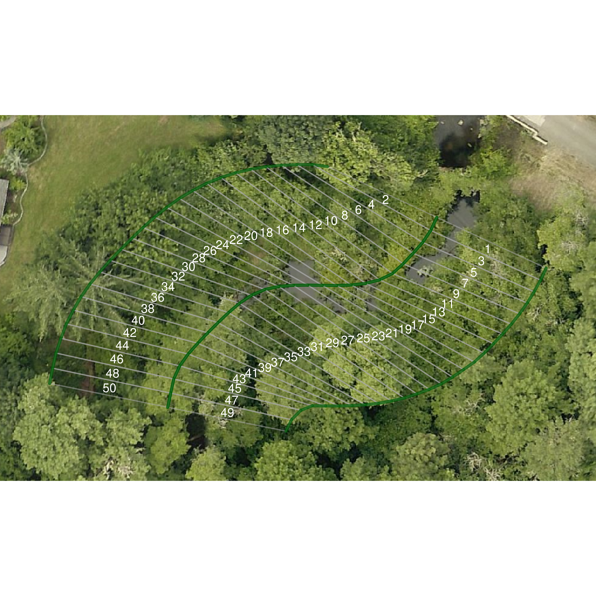
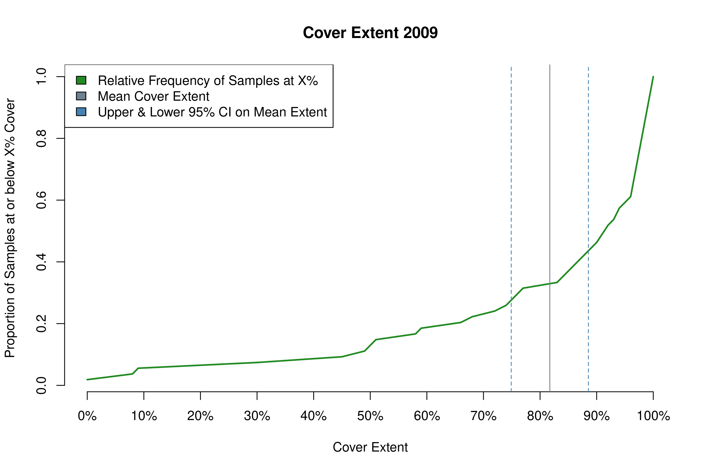
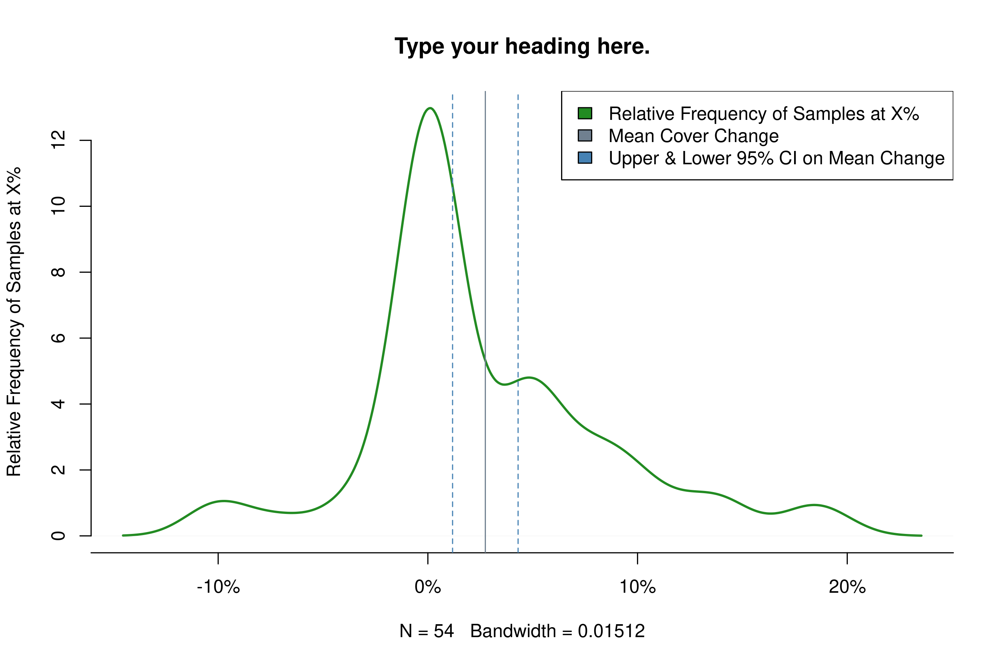
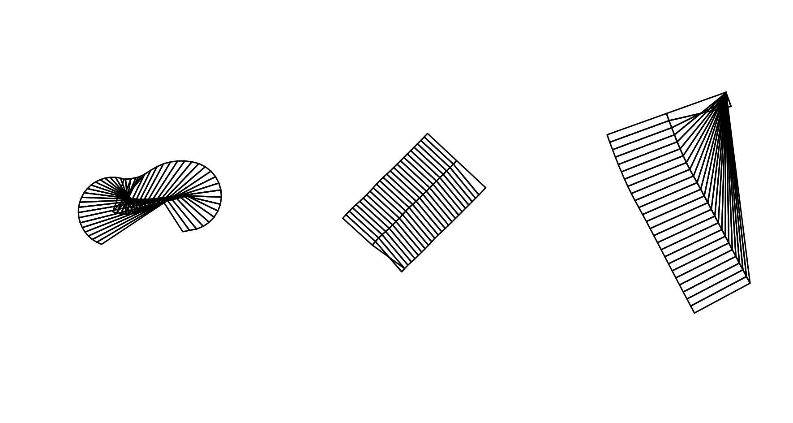

```{r setup, include = FALSE}
knitr::opts_chunk$set(
  collapse = TRUE,
  comment = "#>"
)
```

Welcome to the `vignette` for the package `riparian`, a suite of tools designed to help Benton County Community Development staff analyze riparian cover extent and change in cover over time.  This document models the workflow of producing an annual monitoring report for the Benton County riparian monitoring program, and demonstrates how functions in the `riparian` package can make monitoring faster and more efficient for the researcher.

## Step One:  Site Plots

Benton County conducts riparian monitoring whenever new high resolution (1-foot) orthographic imagery becomes available.  Likely, your are reading this because new imagery is about to arrive.

The County currently monitors 54 randomly selected sites along priority corridors, and may add additional sites based upon future permit approvals.  The reason we look at the same 54 sites every year is because we are trying to detect change in cover.  If we looked at a different slew of sites each year, it would be hard to know whether an increase or decrease in cover were due to variation between the sites we selected, or whether vegetation removal or accrual occurred.  Using this method, we can circle individual trees that have gone missing from one year to the next.  Because the sites are randomly selected and representative of conditions in the priority corridor generally, we can be reasonably confident that changes in cover within the sample reflect conditions in the priority corridor.


### The Library Path

The standard library of a programming language reflects a stable but limited number of core features.  User-defined libraries allow the community to experiment with alternative implementations of more complex features before incorporating a chosen method into the standard library, or the feature may indefinitely remained as user-defined code on github or CRAN.  Some of the more powerful and user-friendly libraries in R are available on the official R archive, CRAN, but to employ their functionality we must first download the source code and compile it on our workstation.  Most users of R do not need to know the location of the library path where R stores code from externally downloaded libraries.  If you using a workstation that is not linked into the county network, then you probably do not need to know, either.

If you using a county computer linked into the network, as of 2021 there is an additional security firewall in place that confuses Rstudio when it tries to locate the library path.  We need to manually insert the correct path into the list of places that Rstudio looks.  If you are starting a fresh session of RStudio, remember to set the path to your personal package library using the .libPaths() function.

```{r libpath}
# add your personal library path to libPaths
# remember to run this at the start of every Rstudio() session!
# replace 'P:/lib' with the path to a dedicated folder in your workspace
.libPaths( c( 'P:/lib', .libPaths()) )
```

### Sampling Boxes

The `riparian` package contains several data objects related to riparian monitoring in Benton County.  You can access these data objects by name using the `data()` function, or they will load automatically with the rest of package when using `library().  Access the polygon shapefile containing the 54 sampling boxes as shown:

```{r samples}
# load the package, all associated functions and data objects
library(riparian)

# alternative method: access the sampling box object without loading the full package
data(random_samples, package = 'riparian')

# use the sf package to plot the first box
plot(sf::st_zm(random_samples[1, ]), main = 'Example Sampling Box')
```

In 2018, the County collected orthographic imagery in S:/maps/OrthoPhotos, with each year of imagery in a separate folder.  Each raster file is typically a large file covering a broad extent of the county.  Performing operations on these files is expensive, and when using the county network can slow traffic for others and increase the risk of dropped connections or other errors.  If you can copy the years of interest to an external drive, this can minimize network traffic and speed performance at your workstation.  However, due to the size of the data, orthographic data from the whole county will likely not fit on hard drive of a laptop.

Compared the size of the survey images, the monitoring boxes are relatively small.  The `thumbnails()` functions produces smaller raster files just big enough to fit a given set of sampling boxes.  These raster files are small enough to fit on a laptop without impeding performance, allowing one to conduct the remainder of the analysis without being tethered to an external drive or the county network.

### Thumbnail Images

The `thumbnails()` function takes three arguments.  `in_path` is the directory path for orthoimagery.  `out_path` is the directory in which to print the thumbnail images.  `polys` is the sampling box spatial object.

R uses the convention of forward slashes in path names (for instance, the path to my working folder for this project is 'P:/Riparian' and the path to the 2018 imagery is 'S:/maps/OrthoPhotos/Oregon2018').  The function expects a character string, so the path name needs to have single or double quotes around it.  When you run this function, it will produce a .tif file in the output directory centered around each sampling box in the `polys` argument.

```{r thumbnail, eval=FALSE}

# crop small images of the sampling area and print to personal drive
thumbnails(in_path = 'S:/maps/OrthoPhotos/Oregon2018',
           out_path = 'P:/Riparian',
           polys = random_samples)

```
  
### Sample Plots

In order to assess the level of cover over a sample area, we need to project the lines of the sampling box over the new orthographic imagery. The function for printing these plots is called `plot_samples()`.  The full syntax for the function is `plot_samples(in_path, out_path, polys = random_samples, year, type = 'random', method = 'lm')`.  Let's break down these arguments one by one.

The first argument is called `in_path` and it is the path to the directory of orthographic imagery.  If you made a directory of thumbnails, use this directory as your `in_path` argument.  The second argument is `out_path`, and specifies the location where the function will print the sample plots.  The third argument, `polys` is the polygon shapefile of sampling boxes.

The `year` argument is an integer that represents the year of orthographic survey.  Do not try getting fancy and entering 'year = 2020jun' or somesuch, because the tools in this package use this number a lot.  Each one is expecting an integer and will break if they do not get one.

The `type` argument, on the other hand, is entirely there for your convenience. You can even safely ignore it.  In 2018, I wanted to know if the level of cover was different in taxlots where the county had issued permits that might affect the riparian zone, compared to the priority corridor as a whole.  I labeled random samples in the riparian corridor as 'random' and samples where the county had issued permits as 'permit'.  The `type` argument is expecting a word of your choice wrapped in quotes.  Other tools in the `riparian` package allow you to filter your sample pool by the `type` names you specify.

### Predicting Cover

The `plot_samples()` function predicts the level of cover in each slice of the sampling box using a linear regression fit to the record of sample observations from 2018, 2016 and 2009. The function adds a green bar to the outer edge of the sample box where it predicts full cover, yellow on slices of partial cover, and red on slices of bare ground.  The function also outputs a spreadsheet containing the predicted values, correctly formatted for later use by other tools in this package.  The spreadsheet output can save you labor by automatically scoring easy calls.

Currently the `plot_samples()` function defaults to using a linear model that expects 4-band imagery (rgbn) as an input.  If you are using 3-band imagery (rgb), then you can tell the function to use a different linear model using the `method` argument.  For 3-band imagery, use the argument `method = 'lm3'`.

The default `polys = 'random_samples'` means the function looks for an object called `random_samples` in the current environment, so you can omit this argument for the random annual monitoring boxes if you have loaded `random_samples` into the current environment.  You can omit the argument names in a function call and R will process the arguments in the order given, but if you omit arguments to use the default, or otherwise provide function arguments out of order, then you need to include the name of specific arguments in the function call.

```{r plot_samples, eval=FALSE}
library(riparian)

# change the path names
setwd('/path_to_shapefile/')
samples <- rgdal::readOGR('mysamples.shp')

# change the path names
# change year value to your year
# use method = 'lm3' for 3-band rgb imagery
plot_samples(in_path = 'S:/maps/OrthoPhotos/Oregon2018',
             out_path ='P:/riparian/sites2018',
             polys = random_samples,
             year = 2018,
             type = 'random',
             method = 'lm')
```

<center>

<br>
**Example Sample Plot**
</center>

The `plot_samples` function prints a .png file into the `out_path` directory for each sampling box in the `polys` object, showing the sampling box superimposed over the aerial imagery, with slices labeled by number (as shown in the example plot above).

## Scoring Samples

Once you have printed sampling plots for all sites, it is time to score cover extent.

In 2018 I created an excel file called `samples2018.xlsx` to record cover extent for the 2018 annual monitoring report and the 5-year trends and status report.  In order for the functions in `riparian` to work correctly, it is important for you to format your record of observations exactly like the spreadsheet from 2018.  First, let's take a look at that spreadsheet by loading it into the workspace.  You can examine the data as a native R object, loaded automatically with the riparian package, or using the `data` function.

```{r native_spreadsheet}
# load the package, if you have not already done so
library(riparian)

# alternative method, load the data object without the rest of the package
data(samples2018, package = 'riparian')

# examine column names of observations spreadsheet
colnames(samples2018)
```

The spreadsheet has 53 columns, named `id`, `year`, `type` and then numbered 1:50.  Your spreadsheet must adhere to this format, using 53 columns named just so.  The `id` column refers to an individual site id associated with each site.  The `year` column specifies the year of observation.  The `type` column is for grouping sites into subsets, such as sites with active permits to track compared to random samples, and may be left blank without consequence.  The columns numbered 1:50 correspond to the numbers on the sample plots printed by `plot_samples()`.  When you are scoring observations, enter the cover score associated with the number on the sampling plot under the column with the same number in the spreadsheet.

The easiest way to adhere to the format requirement manually is to add new observations to the bottom of the 2018 spreadsheet, and save it under a new name.  You can convert the R object into a csv file using the command `write.csv(samples2018, 'myobs.csv')` and fill in your observations using Excel.  If you are using the spreadsheet output from `sample_plots()`, then the spreadsheet is already formatted correctly.

When you are done editing your file in Excel, export it into csv format, which is a tried and true way to share data between programs.  Read the csv into RStudio using the `data.table` package:

```{r csv, eval = F}
# once you have entered cover extent scores into a spreadsheet saved as a csv
# load the csv into R
# change 'myobs.csv' to the path name to your file
obs <- data.table::fread('myobs.csv')

# as of 2021, data.table adds an index column when it reads from a csv
# drop the added column (the first one), keeping the original data
obs <- obs[ , -1]

# your spreadsheet should have matching columns with samples2018
# so you can bind them together by row to create a new master record
obs <- rbind(obs, samples2018)

# save the master record as csv
write.csv(obs, 'samples_MyYear.csv')
# or as a data object
save(obs, file = 'samples_MyYear.rds')
```

If you are using the predicted cover spreadsheet, then as you inspect each site plot, observe whether each slice is assigned the correct cover class.  Where the predicted class is incorrect, you can update the spreadsheet in Excel.  The column names correspond to the slice numbers on the site plot, and the rows of the spreadsheet will be in the order of the sampling boxes fed to the `plot_samples()` function.  So long as you do not have to do too much manual editing, the prediction feature has the potential to save time compared to manually scoring each slice from scratch.

Note that while you can cut and paste the corrected scores onto the end of the previous observations in Excel, you can also bind them together easily in R using the native function `rbind()`.


### Subsetting Sites

The `riparian` package takes advantage of several features of the `data.table` package.  The `data.table` is a special class of `data.frame`, with unique syntax for subsetting data.

The first subsetting you will likely want to do is subset by year.  Do this by selecting the column `year` and setting it equal to the target value.  Place this logical test in brackets following the data.table name, and R will return only those observations that pass the test.  Note that logical tests use two equal signs (eg. `year == 2018`).

```{r dt}
library(data.table)
# print summary table of obs by year
samples2018[ , .N, by = year]

# subset year of interest
sub18 <- samples2018[year == 2018]

# verify subset is correct
sub18[ , .N, by = year]
```

The `type` variable is a catch-all for you to define and compare groups within the sample.  The 2018 dataset includes a type value `permit`, which refers to sites with active permits we selected for random monitoring.  We can split the dataset into two groups by using `==` and `!=` (not equal) to divide the data by `type`:

```{r}
# print table of obs by type
samples2018[ , .N, by = type]

# subset permit and nopermit sites
permit_sites <- samples2018[type == 'permit']
nopermit_sites <- samples2018[type != 'permit']

# examine results
permit_sites[ , .N, by = type]
nopermit_sites[ , .N, by = type]
```

To subset by multiples criteria, you can subset sequentially or use logical operators `&` and `|` to nest multiple logical tests.

```{r}

# subset 2018 sites with type trib or permit
sub <- samples2018[year == 2018]
sub <- sub[type == 'trib' | type == 'permit']

# verify subset has correct number of obs
sub[, .N, by = .(year,type)]

# subset 2016 sites with type trib or permit
sub <- samples2018[year == 2016]
sub <- sub[type == 'trib' | type == 'permit']

# verify subset has correct number of obs
sub[, .N, by = .(year, type)]
```


## Plot Cover Extent

The function `plot_cover(csv)` produces a plot of cover extent over all the samples in the object `csv`.  To produce a plot of cover extent for a given year, subset the observations in the data.table by year in the argument to `plot_cover()`.  Optional arguments: the argument `title` sets the name of the .png file printed into the working directory.  The argument `heading` sets a title for the plot (default is blank).  The argument `leg_pos` adjusts the legend position and accepts the arguments `topright`, `topleft`, `bottomright` and `bottomleft`.  You may need to adjust the legend position from its default so it does not cover the data you are trying to display.

Note that a table of statistics prints to the console.  Copy these values into an Excel file to create tables of summary statistics for cover extent in your monitoring report.  The function also produces a plot of cover extent (example shown below).  The green line is the cumulative distribution function for cover extent, and it shows the proportion of total samples that are at or below the level of cover on the x-axis.  The gray vertical bar shows mean cover extent, and the dotted blue lines show the 95% confidence interval around that mean.

```{r plot_cover, fig.show = 'hold'}
library(riparian)
# plot cover extent for all samples in 2018 using default settings
plot_cover(samples2018[year == 2018])
# plot cover extent for all samples in 2009, specifying a heading and output name
plot_cover(samples2018[year == 2009], 
           title = 'my_cover_plot.png', 
           heading = 'Cover Extent 2009')
# plot cover extent for non-tributary samples in 2018, specifying legend location
plot_cover(samples2018[year == 2018 & type != 'trib'], leg_pos = 'topleft')
```
<center>

<br>
**my_cover_plot.png**
</center>

## Plot Cover Change

The function `plot_change(csv, year1, year2)` produces a plot of cover extent change from `year1` to `year2` across samples in `csv`.  Here the function does the subsetting for you in the case of year, but you can still subset `csv` by type.  The optional arguments are the same as for `plot_cover`.

```{r plot_change, fig.show='hold'}
# plot cover change from 2016 to 2018 using default settings
plot_change(samples2018, 2016, 2018)
# plot cover change in non-tributary samples from 2016 to 2018
plot_change(samples2018[type != 'trib'], 2016, 2018)
# plot cover change from 2009 to 2016, specifying heading, output name, and leg_pos
plot_change(samples2018, 2009, 2016, 
           title = 'my_change_plot.png', 
           heading = 'Type your heading here.',
           leg_pos = 'topright')
```

<center>

<br>
**my_change_plot.png**
</center>

## Clean Permit List

A staff member from the planning department will email you an Excel sheet containing all permits the County has issued since the last monitoring report.  Reading the file into R will require a little extra work preparing the data in Excel.  Open the permit list in Excel, and note that the first column should be `Record Number` and the fifth should read `MapTaxlot #`.  Likely, many of the MapTaxlot numbers will be printed in scientific notation in their cells.  That is a problem, because R will interpret the cells as character vectors, and the ending 7 digits of the MapTaxlot number will be lost.  But first, scroll down and note the first cell where the MapTaxlot number has a little green triangle in the upper left corner.  In order to avoid MapTaxlot numbers displaying in scientific notation, some planning staff display numbers as text in the Excel formatting options.  This is problematic because Excel converts them back to numbers and hence to scientific notation when exporting the file in csv format, and then R interprets it as a character string again.  

Click on the first cell where a MapTaxlot number has the green triangle in the upper left corner, then scroll to the last permit on the sheet and click on its MapTaxlot number while holding the shift key so that you select the entire column below the cell with the green triangle.  Scroll back to the first cell you selected and click on the yellow exclamation point, bringing down a dropdown menu.  From the menu select `Convert to Number`, and watch all the numbers displayed as text revert to scientific notation.

Now scroll to the top of the sheet and select the whole column for `MapTaxlot #`.  Right click on a cell in the highlighted column and click on `Format Cells...`.  The `number` tab should display. Select from the `Category` menu `Number`.  Change `Decimal places` from 2 to 0.  Click `OK`.  With all MapTaxlot numbers converted to number strings and displayed as integers, it is now safe to export the sheet as a csv file to import into R.  Select `Save As`, choose a directory, and from the `Save as type` menu select `CSV (Comma delimited)`.

Read the `csv` file into R using the same `fread` command as for the cover score sheet.  To demonstrate the functionality of the package, I have included a list of permits from 2013 to 2018 as a package object, which you can access by loading the `riparian` library or using the `data` function.

```{r perm_list}
# load the riparian library, if you have not already done so
# the permit list from 2013 to 2018 is saved in the package as `permits_13to18`
library(riparian)

# examine column names of the permit list spreadsheet
colnames(permits_13to18)

# Note we have renamed the columns 'Record Number' and 'MapTaxlot #' 
# from the planning department's original list of permits to
# 'record_no' and 'maptaxlot', in order to eliminate the use of spaces and
# non-alphanumeric characters, which are invalid in data object names. 

# Change the names of the first and fifth column of the new permit list in Excel  
# to match the original list before you load the new permit list 
# from the planning department.

# Make sure to convert maptaxlot #s from scipen to integers before importing.  
```
```{r perm_list2, eval = F}
# Edit the file path to point to your csv file.
perms <- data.table::fread('/path_to_file/my_permits.csv')

# not all permits issued by the county include property in the riparian corridor.  
# subset properties from the permit list within the priority corridor 
# using the sf_lots object, a set of polygons of taxlots in the priority corridor.
perm_sub <- perms[perms$maptaxlot %in% sf_lots$MapTaxlot, ]

# Bind the new permit list to the old by row into a single exhaustive permit list.
# The columns of old and new must match (in name and number), or this will fail.
perms <- rbind(perm_sub, permits_13to18)

# Save the exhaustive list as a data object or csv file.
save(perms, file = '/path_to_drive/my_permit_list.rds')
write.csv(perms, file = '/path_to_drive/my_permit_list.csv')
```


## Change Tables

The planning staff is concerned with which map taxlots have experienced net cover decrease, especially if the decrease is greater than 10%.  The `build_change_table()` function produces a change table designed for use by the planning staff.  The purpose of this tool is to enable staff to locate where change is occurring, which property owners are involved, and whether any county issued permits may be related.  The change table ranks sampling sites by mean cover change, and includes columns with all MapTaxlot numbers falling within the sampling box and all permits associated with a MapTaxlot on the permit list.

The full syntax for the function is `build_change_table(csv, year1, year2, polys, lots, permits)`.  The argument `csv` is the record of cover scores for the sampling sites.  The arguments `year1` and `year2` are integers matching values in the `year` column of `csv`.  The argument `polys` is the spatial polygons object of samplings boxes.  The argument `lots` is the polygons object of MapTaxlots, and `permits` is the permit list formatted according to the instructions in the previous section.  The output is a csv file printed to the working directory.

```{r change_table}
build_change_table(csv = samples2018,
                   year1 = 2016,
                   year2 = 2018,
                   polys = random_samples,
                   lots = sf_lots, 
                   permits = permits_13to18)
```

When a change table indicates that the cover extent has decreased, it is important to ascertain whether the decrease is the result of measurement error or actual canopy cover decline.

 * Inspect the sample plots from the previous and current year.  Can you identify cover loss?
 * If you can identify specific trees or limbs that have been removed, create a slide showing the before and after image with the removal circled to present to planning staff.
  - Try to ascertain on which map taxlot the removal occurred and include the number.
  - Include all permit numbers from the change table column associated with the sample.
 * If no discernible loss has occurred, but changes in camera aspect cause the position of tree canopy relative to the sampling box to move, record as measurement error and disregard.
  - We ignore this type of error because it is random (as likely to make cover go up as down) and small relative to sizes of changes we are measuring.
 * If no discernible loss has occurred, but shading effects caused disparate scores between years, correct the shaded record to match the fully visible record and rerun the analysis.
  - If the corrected record is a prior year, include a corrections table for the prior year in your final report.
  
### Comparing Areas with Permits to Random Areas

If cover were to decline in areas where the county has issued permits, the question would naturally arise as to whether permits were a cause.  The county also monitors randomly selected areas in priority riparian corridors.  If cover also decreased in randomly selected areas, it is unlikely permits were the primary cause of decline.  If cover decreased significantly more in permitted areas, then we could not rule out permits as a potential cause.  Whether permits are a plausible cause of cover decline depends on the broader context of how cover is changing in the priority corridor as a whole.

To compare the difference in mean cover extent between samples of different types in the same year, we use the `t.test` function included in the `stats` package, part of R's standard library.  First, remember that each surveying box contains 50 slices, which we need to aggregate into a mean cover score.  Each surveying box has a mean cover extent, and we are comparing the mean of mean cover extents in one group to another.  So, after calculating mean cover extent for each row of data, subset the data into distinct groups using the `year` and `type` variables.

```{r welches}

# cover score observations from 2009-2018
dt <- samples2018

# use apply to convert each row of score observations
# into a mean cover extent per sampling box
dt$mn <- apply(dt[,4:53], 1, function(x) sum(x)/100)

# subset random samples and permit samples for 2018
dt_random <- dt[year == 2018 & type == 'random', ]
dt_permit <- dt[year == 2018 & type == 'permit', ]

# welch two-sample t-test
t.test(dt_random$mn, dt_permit$mn)
```

Note the confidence interval associated with the Welch two-sample t-test in your monitoring report.  If the confidence interval overlaps zero, the two sample means are not statistically distinguishable from one another with 95% confidence.


## Sampler

The time will come when you need to draw new sampling boxes to sample new places.  Typically the County will approve new permits and flag those permits that may result in reduction of cover in the priority corridor.  Your bosses may ask you to include newly permitted areas in your sample.  The `sample_streams()` function generates new sampling boxes along the priority corridor within the area of your choice.  

The full syntax for the function is `sample_streams(n=100, lots=sf_lots, prc=sf_per, strms=sf_strms)`.  The argument `n` is the number of sampling boxes you want to produce, and defaults to 100.  The argument `prc` is the line file along which the function generates random points.  The default (`sf_per`) is the NHD set of perennial or fish-bearing streams, clipped to the extent of the RR zone, and you should be able to leave the default as is.  

The argument `strms` defaults to the WSI hydro-enforced drainage layer clipped to the priority corridor (`sf_strms`).  The WSI hydro-enforced drainage layer is more accurate than the NHD dataset, so the function finds the nearest point on the WSI layer to the random point generated on the NHD layer, and draws the sampling box around that point.

The argument `lots` is the polygon object that specifies the area within which you want to draw samples, and defaults to the whole priority corridor (`sf_lots`).  If you have a list of permitted sites to check, then clip the `sf_lots` object down to only those taxlots you want to check, and specify the location of the resulting object in the `lots` argument.

What we casually refer to as random numbers in computer code refer to pseudo-random number generators, or complex deterministic algorithms.  Deterministic means that we will get exactly the same output given a specific input, what we call a `seed`.  By setting the `seed` in R, you can generate a string of seemingly random numbers that is reproducible.  Consider it a best practice to set and record your seed before taking random samples, especially for research involving the public.

To demonstrate the function, I will generate a random sample of lots within the priority corridor, then draw sample boxes using `sample_streams()`.

```{r sampler, eval = F}
# let's say you did this earlier
perms <- data.table::fread('/path_to_file/my_permits.csv')  # my new permit list
perm_sub <- perms[perms$maptaxlot %in% sf_lots$MapTaxlot, ]  # permits within corridor
perms <- rbind(perm_sub, permits_13to18)  # merge together old and new permits
save(perms, file = '/path_to_drive/my_permit_list.rds')  # save as R data object

# load the saved permit list
# this loads the object named `perms` created above within a new session
load('/path_to_drive/my_permit_list.rds')

# subset lots in the riparian corridor where the maptaxlot number
# matchs one of the maptaxlot numbers in the permit list
permit_lots <- sf_lots[sf_lots$MapTaxlot %in% perms$maptaxlot, ]

# always set the seed immediately prior to taking the random sample
set.seed(777)

# sample 10 spots from permitted lots in the riparian corridor
new_sample <- sample_streams(n = 10, lots = permit_lots)
```

### Bad Sampling Boxes

The sampling tool has known bugs that cause sampling boxes to fail to draw correctly.  I would offer an expected date when these bugs might be resolved, but let's just say I was lucky to get the sampler function working at all.  When you generate a series of sampling boxes, it is possible that many will be good boxes and some will be bad boxes.  My strategy was to create more sampling boxes than I needed, and then to delete bad or unwanted boxes from the resulting spatial object.

R recognizes the sampling boxes as spreadsheets with associated spatial data.  Each sampling box is a row of data, and you can delete unwanted rows as shown in the code snippet below.  Note the use of the concatenate function `c()` to delete multiple samples at once.

```{r bad_box, eval = F}
# remove unwanted sample from polygons object
samp1 <- new_sample[ , -2]  # remove second sample
samp2 <- new_sample[ , -c(3,7:9)]  # remove samples 3, 7, 8 and 9
```

<center>

<br>
**Bad Boxes**
</center>

### Appending Samples

When you have a pre-existing set of sampling boxes, you may wish to append additional sampling boxes to the end.  For instance, you may have a set of sampling boxes used for permit-based monitoring in a previous report.  When presented with a list of new permits the county has issued since the last report, you may elect to take a smaller number of samples from the new pool and add these to the pre-existing set.

Since the sampling boxes are represented as lists, you construct a new sampling object by concatenating two lists together using the `c()` function.


```{r appending_samples, eval = F}
# just demonstrating how this works
# there is no practical reason to perform these merges

# append permit samples to random samples
merged_1 < - c(random_samples, new_sample)

# append permit samples to itself
merged_2 < - c(new_sample, new_sample)
```


### Exporting Sampling Boxes

You can export a polygons object into a shapefile using the `writeOGR()` function from the `rgdal` package.  Since there is a lot of good online documentation for that package, I will present an example of how to export your data using the function in the code snippet below, but I will not explain the nuts and bolts in detail.  Alternatively, you can save your work as a native R object (.rds format).  This is the recommended method if you are storing objects for projects that are in progress, but when you have a finished product consider it best practice to export it to a shapefile, because the county GIS standard is ArcGIS.  If you save it only as a native R object, the rest of the staff may be unable to use it on their software.

```{r save, eval = F}
library(rgdal)

# export to shapefile
rgdal::writeOGR(obj = new_sample, 
                dsn = 'path_to_my_dir',
                layer = 'new_sample',
                driver = 'ESRI Shapefile')

# save as native R object
save(new_sample, 'my_new_sample.rds')  # you must include the .rds extension

# load a saved object
load('my_new_sample.rds')

```


## Predicted Cover

The `pred_cover()` function predicts the level of vegetative cover using an NDVI-based model.  Over a given spatial polygon, the function predicts the level of cover based upon orthographic imagery, and prints a new raster of predicted cover values to a specified directory `out_path`.

The full syntax of the function is `pred_cover(polys, in_path, out_path, rgb_path = NULL, cir_path = NULL, buff = sf_buff)`.  The argument `polys` is the spatial polygon object of taxlots over which you want to predict cover.  This function is designed to default to 4-band imagery, so the argument `in_path` is a character string representing a directory path to 4-band imagery.  In 2016, the County received 3-band RGB and CIR imagery.  If this is the case for you, set the arguments `rgb_path` and `cir_path` to directory paths to the RGB and CIR imagery respectively, and do not specify an argument for `in_path`.  The argument `buff` is the riparian buffer for the WSI hydro-enforced layer clipped to the Rural Residential zone.


```{r pred_cover, eval=F}
# not run
# change directory paths to point to your data

pred_cover(random_lots, out_path = 'E:/Riparian/pred_2016/',
           rgb_path = 'S:/maps/OrthoPhotos/Hexagon2016/RGB/',
           cir_path = 'S:/maps/OrthoPhotos/Hexagon2016/CIR/')


pred_cover(random_lots, 'E:/ortho2018', 'E:/Riparian/pred_2018/')

# predict cover change
pred_change('E:/Riparian/pred_2016', 'E:/Riparian/pred_2018', 'E:/Riparian/chng_16to18')

```

## Predicted Cover Change

The `pred_change()` function predicts the level of change in riparian cover based upon the output of the `pred_cover()` function.  The full syntax is `pred_change(year1_path, year2_path, out_path)`.  The argument `year1_path` is a character string specifying a directory path to the rasters produced by `pred_cover()` for year 1, and the argument `year2_path` is a character string specifying a directory path to the rasters produced by `pred_cover()` for year 2.  The argument `out_path` specifies the directory to which the function will print rasters with values of predicted change in cover.

Produce a table summarizing the predicted change in cover using the function `pred_change_report()`.  The full syntax is `pred_change_report(chng_path, year1_path, year2_path, permits = permits_13to18, lots = sf_lots, title = 'pred_chng_table.csv')`.  The argument `chng_path` is the path to the directory of predicted change rasters produced by `pred_change()`.  The arguments `year1_path` and `year2_path` specify the paths to the directories of predicted cover rasters output by `pred_cover()` for year 1 and year 2 respectively.  The argument `permits` is the same csv file of approved permits you used to produce change tables of randomly selected sites.  The default is set to the list of permits from 2013 to 2018 to help demonstrate the functionality of the package in this vignette.  The argument `lots` defaults to a shapefile of taxlots in the priority corridor, and the function uses this file to search for which taxlot a given area of the priority corridor lies within.  The argument `title` specifies the title of the predicted change table, which should end in '.csv', and prints to the working directory.

```{r change_report, eval=F}
# not run
# change directory paths to point to your data

pred_change_report(chng_path = 'E:/Riparian/chng_16to18/', 
                   year1_path = 'E:/Riparian/pred_2016/', 
                   year2_path = 'E:/Riparian/pred_2018/')

```

